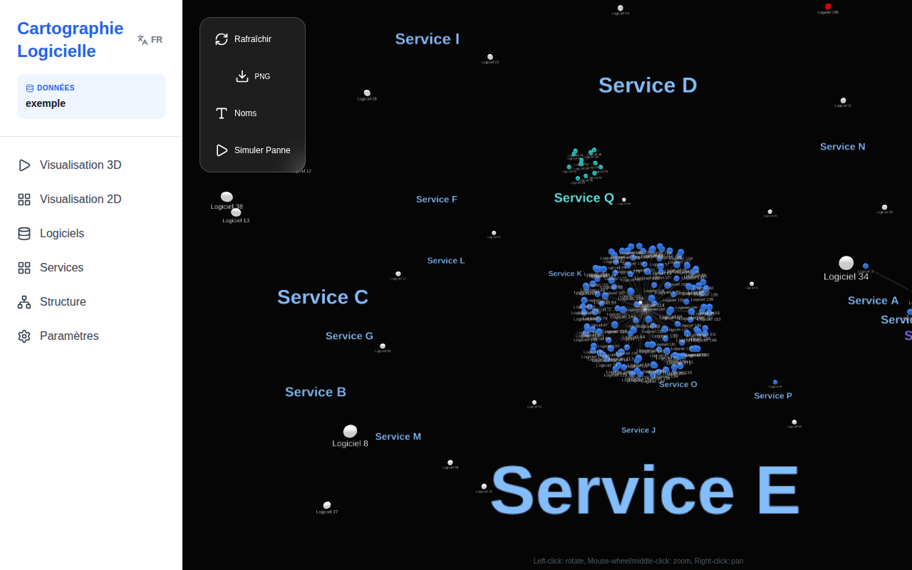
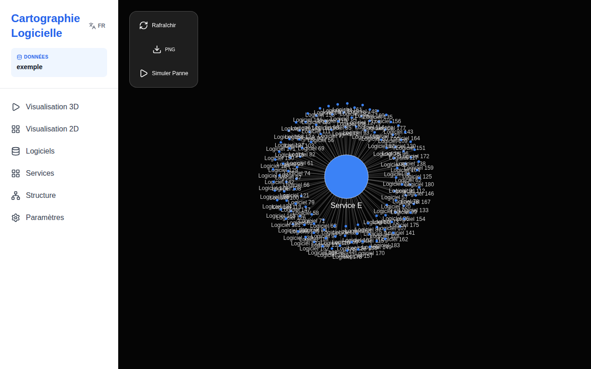
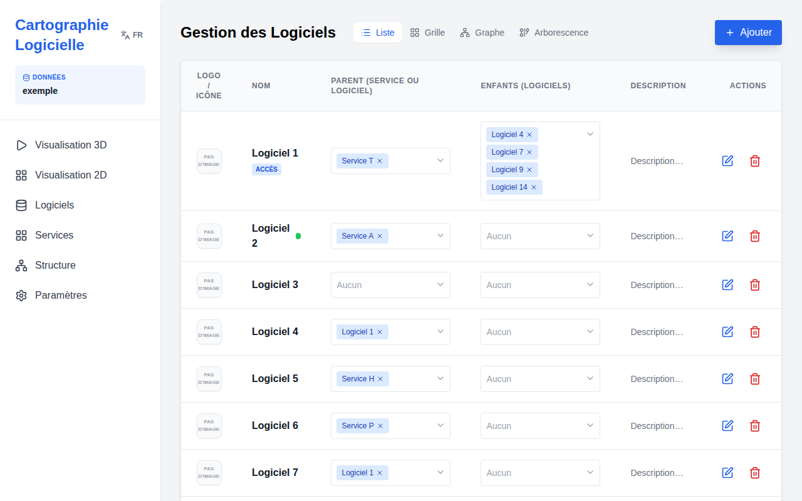
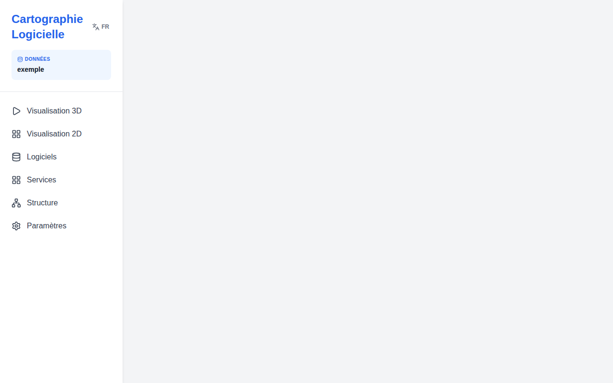

# Cartographie Logicielle 2D & 3D / 2D & 3D Software Cartography

[Français](#français) | [English](#english)

<a name="français"></a>
## Français

Ce projet est une plateforme interactive de visualisation et de simulation de l'écosystème logiciel, structuré en services et composants logiciels.

## Architecture

Le projet est un monorepo comprenant :
- **Frontend** : Application React avec `react-force-graph-3d`, `react-force-graph-2d` et Tailwind CSS.
- **Backend** : Serveur Node.js Express.
- **Base de données** : Plusieurs jeux de données JSON stockés dans `server/data/datasets/`.
- **Paramètres globaux** : `server/data/settings.json`.

## Installation

Pour installer toutes les dépendances du projet (racine, client et serveur) :

```bash
npm run install:all
```

## Démarrage

Pour lancer simultanément le serveur (sur le port 5000) et le client (sur le port 3000) :

```bash
npm start
```

## Fonctionnalités Principales

### Visualisation et Simulation (2D & 3D)
- **Vues Dynamiques** : Basculez entre une vue 3D immersive et une vue 2D fluide.
- **Analyse de Lignage** : Cliquez sur un nœud pour mettre en évidence ses ancêtres et ses descendants via des effets de lueur et des flux de particules.
- **Simulation de Panne** : Mode "Simuler Panne" pour analyser les impacts en cascade. Les nœuds en échec sont rouges, les éléments impactés sont oranges.
- **Export** : Exportez vos analyses au format CSV ou capturez la vue au format PNG.

### Gestion Multi-Jeux de Données (Datasets)
- Gérez plusieurs environnements ou projets séparément.
- Importez des fichiers CSV dans le jeu de données actif.
- Basculez entre les jeux de données instantanément via l'interface des Paramètres.

### Administration Avancée
- **Relations Multi-Parents** : Un logiciel ou un service peut désormais dépendre de plusieurs parents.
- **Index de Criticité** : Classification Tier 1 (Rouge), Tier 2 (Orange), Tier 3 (Vert) avec héritage automatique des services vers les logiciels.
- **Bibliothèque d'Icônes** : Intégration complète de la bibliothèque Tabler Icons pour une identification visuelle rapide.
- **Vues Flexibles** : Listes tabulaires, grilles de cartes, graphes de force ou arborescences hiérarchiques.

## Données et Médias
- **Datasets** : `server/data/datasets/*.json`
- **Médias** : Les logos téléchargés sont sauvegardés dans `server/uploads/`.
- **Captures de Vérification** : Disponibles dans `client/media/`.

## Tutoriel d'Utilisation

### 1. Visualisation Interactive (3D & 2D)
Utilisez la vue 3D pour explorer l'écosystème. Cliquez sur un nœud pour illuminer son lignage (ancêtres et descendants). Les liens afficheront des particules animées indiquant la direction de la dépendance.


Basculez sur la vue 2D pour une analyse plus plate et schématique.


### 2. Simulation de Panne
En mode simulation, cliquez sur un logiciel pour voir l'impact d'une panne. Le nœud sélectionné devient rouge, et tous les éléments dépendants virent à l'orange. Vous pouvez exporter le rapport d'impact en CSV.

### 3. Administration des Logiciels et Services
Gérez vos données via des tableaux interactifs. Vous pouvez éditer les icônes, la criticité (Tier 1 à 3) et les relations multi-parents.


### 4. Gestion des Jeux de Données
Dans les paramètres, vous pouvez créer de nouveaux environnements, importer des fichiers CSV ou changer le jeu de données actif.


### 5. Importation de Données (CSV)
Vous pouvez importer massivement des logiciels et les lier à des services via un fichier CSV.
- **Modèle de fichier** : [Télécharger le modèle CSV](/template_import.csv)
- **Colonnes supportées** : `Logiciel` (nom), `Service` (nom du service parent), `Accès` (Oui/Non), `Description`.
- L'importation créera automatiquement les liens si le service existe déjà.

---

<a name="english"></a>
## English

This project is an interactive platform for visualization and simulation of the software ecosystem, structured into services and software components.

## Architecture

The project is a monorepo including:
- **Frontend**: React application with `react-force-graph-3d`, `react-force-graph-2d`, and Tailwind CSS.
- **Backend**: Node.js Express server.
- **Database**: Multiple JSON datasets stored in `server/data/datasets/`.
- **Global Settings**: `server/data/settings.json`.

## Installation

To install all project dependencies (root, client, and server):

```bash
npm run install:all
```

## Getting Started

To simultaneously launch the server (on port 5000) and the client (on port 3000):

```bash
npm start
```

## Main Features

### Visualization and Simulation (2D & 3D)
- **Dynamic Views**: Toggle between an immersive 3D view and a fluid 2D view.
- **Lineage Analysis**: Click a node to highlight its ancestors and descendants using glow effects and particle flows.
- **Failure Simulation**: "Simulate Failure" mode to analyze cascading impacts. Failed nodes are red, impacted elements are orange.
- **Export**: Export your analyses in CSV format or capture the view in PNG format.

### Multi-Dataset Management
- Manage multiple environments or projects separately.
- Import CSV files into the active dataset.
- Switch between datasets instantly via the Settings interface.

### Advanced Administration
- **Multi-Parent Relationships**: A software or service can now depend on multiple parents.
- **Criticality Index**: Tier 1 (Red), Tier 2 (Orange), Tier 3 (Green) classification with automatic inheritance from services to software.
- **Icon Library**: Full integration of the Tabler Icons library for quick visual identification.
- **Flexible Views**: Tabular lists, card grids, force graphs, or hierarchical trees.

## Data and Media
- **Datasets**: `server/data/datasets/*.json`
- **Media**: Uploaded logos are saved in `server/uploads/`.
- **Verification Captures**: Available in `client/media/`.

## User Tutorial

### 1. Interactive Visualization (3D & 2D)
Use the 3D view to explore the ecosystem. Click on a node to highlight its lineage (ancestors and descendants). Links will show animated particles indicating the dependency direction.


Switch to the 2D view for a flatter, schematic analysis.


### 2. Failure Simulation
In simulation mode, click on a software to see the impact of a failure. The selected node turns red, and all dependent elements turn orange. You can export the impact report to CSV.

### 3. Software and Service Administration
Manage your data through interactive tables. You can edit icons, criticality (Tier 1 to 3), and multi-parent relationships.


### 4. Dataset Management
In settings, you can create new environments, import CSV files, or switch the active dataset.


### 5. Data Import (CSV)
You can bulk import software and link them to services via a CSV file.
- **File Template**: [Download CSV Template](/template_import.csv)
- **Supported Columns**: `Logiciel` (name), `Service` (parent service name), `Accès` (Yes/No), `Description`.
- The import will automatically create links if the service already exists.
